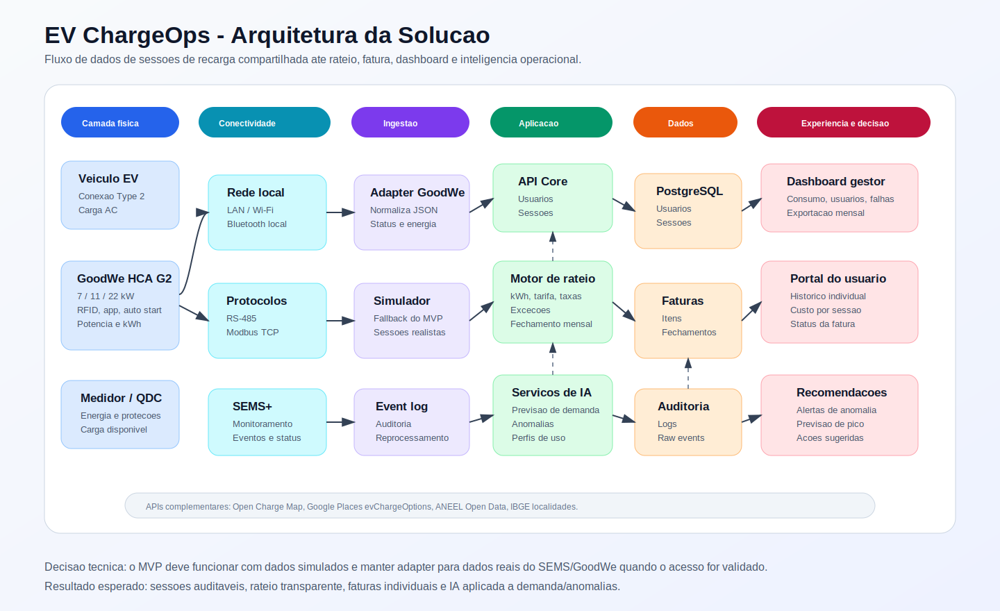

# EV ChargeOps

Projeto Enterprise Challenge 2026 - GoodWe / FIAP  
Sprint 01 - Pesquisa, documentacao e proposta tecnica

## Equipe

> Preencher antes da entrega final.

- Nome da equipe: `[NOME DA EQUIPE]`
- Integrantes:
  - `[NOME DO INTEGRANTE]` - RM `[RM]`
  - `[NOME DO INTEGRANTE]` - RM `[RM]`
  - `[NOME DO INTEGRANTE]` - RM `[RM]`

## Resumo da proposta

O EV ChargeOps e uma plataforma para operar recarga compartilhada de veiculos eletricos em condominios, predios corporativos e campus universitarios. O problema central nao e apenas disponibilizar energia: e identificar quem usou o carregador, medir a sessao com confiabilidade, transformar kWh e tempo em cobranca justa, reduzir conflitos de rateio e oferecer ao gestor uma visao operacional clara.

A proposta usa o carregador GoodWe HCA G2 como ponto fisico de recarga, integra dados de sessao via rede local, SEMS+ ou API, armazena eventos em uma base auditavel e aplica regras de rateio por usuario/unidade. A inteligencia artificial entra como componente estrutural para prever demanda, detectar anomalias de consumo e apoiar o gestor com recomendacoes operacionais.

## Escopo da Sprint 01

Esta sprint nao exige codigo funcional. O foco e documentar pesquisa, contexto tecnico-regulatorio, arquitetura, modelo de rateio e plano de desenvolvimento para a Sprint 02.

Opcoes de aprofundamento adotadas:

- Frente 1: Opcao A, analise de mercado; e Opcao C, dados publicos.
- Frente 2: Opcao A, mapeamento regulatorio; e Opcao C, APIs complementares.
- Frente 3: Opcao B, papel da IA; e Opcao C, esquema de dados.

## Frente 1 - Contexto e problema

### Infraestrutura de recarga compartilhada

Infraestrutura de recarga compartilhada e o conjunto de equipamentos, rede eletrica, conectividade, regras de uso e sistemas de gestao que permitem que varios usuarios carreguem veiculos eletricos usando pontos comuns ou semi-compartilhados. Em um condominio, por exemplo, o ponto pode estar em uma vaga rotativa, em area comum ou em vaga privativa conectada a uma infraestrutura coletiva.

Os principais desafios operacionais sao:

- Identificacao do usuario: sem app, cartao RFID ou autenticacao equivalente, a administracao nao consegue associar consumo a uma pessoa ou unidade.
- Medicao por sessao: a fatura condominial chega agregada, mas o consumo precisa ser separado por usuario, periodo, kWh e eventuais tarifas.
- Justica no rateio: usuarios que nao carregam nao devem pagar pelo consumo variavel de quem carregou.
- Capacidade eletrica: multiplos carregadores simultaneos podem exigir controle de carga para evitar sobrecarga.
- Transparencia: moradores e gestores precisam consultar historico, custo, duracao e criterios de cobranca.
- Auditoria: sessoes interrompidas, falhas de comunicacao e divergencias de medicao precisam ficar registradas.
- Experiencia de uso: o usuario precisa saber se o carregador esta disponivel, iniciar a sessao com facilidade e receber comprovante.

### Como funciona uma sessao de recarga

Uma sessao de recarga pode ser entendida como uma sequencia de eventos:

1. O veiculo e conectado ao carregador.
2. O carregador detecta a conexao e valida condicoes eletricas e de seguranca.
3. O usuario se identifica via app, RFID, regra de auto start ou autorizacao do gestor.
4. A sessao e iniciada e passa a gerar eventos de tempo, potencia, energia entregue e status.
5. A plataforma coleta ou recebe os dados da sessao.
6. Ao final, a sessao e encerrada por desconexao, comando do usuario, carga completa ou falha.
7. O sistema calcula kWh, duracao, custo e vincula o resultado ao usuario ou unidade.
8. O gestor acompanha indicadores agregados e o usuario recebe demonstrativo individual.

Campos minimos de uma sessao:

- `session_id`
- `charger_id`
- `connector_id`
- `user_id` ou `rfid_tag_id`
- `unit_id`
- `started_at`
- `ended_at`
- `energy_kwh`
- `duration_minutes`
- `peak_power_kw`
- `average_power_kw`
- `start_meter_kwh`
- `end_meter_kwh`
- `status`
- `stop_reason`
- `cost_center`

### Modelos de negocio para recarga compartilhada

| Modelo | Como funciona | Pontos fortes | Limitacoes |
| --- | --- | --- | --- |
| Recarga gratuita | O local absorve o custo como beneficio ou atrativo | Simples para o usuario | Injusto em condominios; nao escala com uso intenso |
| Cobranca por kWh | Usuario paga pela energia entregue | Mais justo e facil de explicar | Depende de medicao confiavel e regra tributaria/local |
| Cobranca por tempo | Usuario paga por minuto ou hora conectado | Desestimula ociosidade da vaga | Pode punir carga lenta ou veiculos com limites tecnicos |
| Assinatura mensal | Usuario paga valor fixo por acesso ou franquia | Receita previsivel | Pode gerar subsidio cruzado entre usuarios leves e intensos |
| Rateio condominial | Consumo e custos sao alocados por usuario/unidade | Adequado para predios compartilhados | Exige relatorios claros e aprovacao de regras internas |
| Modelo hibrido | Combina kWh, tempo ocioso, taxa de operacao e assinatura | Mais flexivel e justo | Requer comunicacao clara para evitar disputa |

### Analise de mercado

| Solucao | Problema que resolve | Funcionalidades principais | Modelo de negocio | Limitacoes observadas | Aprendizado para o EV ChargeOps |
| --- | --- | --- | --- | --- | --- |
| Zaptec Pro | Recarga em garagens compartilhadas e predios multifamiliares | Gestao de acesso, portal, multiplas opcoes de pagamento, balanceamento dinamico de carga, escalabilidade para muitos carregadores | Venda de carregadores e ecossistema de gestao/pagamento integrado por parceiros | Ecossistema orientado ao hardware Zaptec; adequacao local depende de integrador e disponibilidade regional | Escalar carregadores requer gestao de carga e pagamento desde o desenho inicial, nao como complemento |
| Wallbox Pulsar Plus | Recarga residencial e multifamiliar compacta com gestao de energia | App, agendamento, Wi-Fi/Bluetooth, medidor de energia, gerenciamento dinamico de carga e integracao solar | Venda de equipamento e acessorios de energia | Foco forte em uso residencial; recursos de cobranca multiusuario podem exigir componentes externos | A experiencia do usuario precisa ser simples, mas o gestor precisa de camada propria de rateio |
| ChargePoint | Operacao de redes de recarga em escala | Plataforma de gestao, monitoramento, diagnostico, app, pagamentos, roaming, APIs e OCPP | Software/plataforma, rede de recarga e hardware | Solucao robusta, mas possivelmente mais complexa e cara que o necessario para um condominio pequeno | O EV ChargeOps deve herdar a ideia de plataforma operacional, mas manter escopo enxuto para ambientes compartilhados |
| WEG WEMOB | Recarga em condominios com controle e cobranca | Plataforma de gestao, monitoramento, gateway de pagamento, relatorios e cobranca automatica | Equipamentos WEMOB e plataforma de operacao | Dependencia do ecossistema WEG; foco em equipamentos da propria marca | A cobranca precisa ser automatizada e transparente para reduzir intermediarios e contestacoes |

Conclusao da frente: o mercado ja oferece bons carregadores e plataformas, mas ainda existe espaco para uma solucao focada em inteligencia operacional e rateio auditavel para infraestruturas compartilhadas que ja possuem carregadores instalados, como o HCA G2 da GoodWe no Energy Innovation Lab.

### Dados publicos e tendencia de demanda

A ABVE indica crescimento acelerado da eletromobilidade no Brasil. Em fevereiro de 2026 foram emplacados 24.885 veiculos leves eletrificados, alta de 92% sobre fevereiro de 2025. A participacao dos eletrificados nas vendas domesticas de veiculos leves chegou a 14% naquele mes, e os plug-in representaram 69% dos eletrificados emplacados. Esses dados indicam aumento da pressao por infraestrutura de recarga em predios e estacionamentos compartilhados.

Para o projeto, isso reforca duas decisoes:

- A plataforma deve nascer preparada para multiplos usuarios e multiplos carregadores, mesmo que o MVP comece com um unico HCA G2.
- O modelo de dados deve registrar sessoes historicas desde o inicio, pois a inteligencia operacional depende de massa de dados acumulada.

## Frente 2 - Base regulatoria e tecnica

### Regulacao ANEEL

A ANEEL informa que a Resolucao Normativa 819/2018 foi a primeira regulamentacao sobre recarga de veiculos eletricos e que suas disposicoes foram consolidadas na Resolucao Normativa 1.000/2021, no capitulo sobre instalacao de recargas de veiculos eletricos. A Agencia adota regulacao minima para evitar interferencias indesejaveis na rede e para impedir impacto tarifario indevido sobre consumidores das distribuidoras.

Ponto relevante para o EV ChargeOps: a recarga de veiculos eletricos pode ser realizada por qualquer interessado, inclusive com exploracao comercial e precos livremente negociados. Para ambientes privados compartilhados, isso permite estruturar cobranca ou rateio, desde que haja conformidade com normas eletricas, regras condominiais e transparencia.

### Regulacao em Sao Paulo

A Lei Estadual de Sao Paulo n. 18.403/2026 assegura ao condomino o direito de instalar, as suas expensas, estacao de recarga individual em vaga privativa, desde que respeitadas normas tecnicas e de seguranca. A lei exige compatibilidade com a carga eletrica, conformidade com normas da distribuidora e ABNT, instalacao por profissional habilitado com ART/RRT e comunicacao formal previa ao condominio. Tambem impede proibicao sem justificativa tecnica ou de seguranca fundamentada.

Impacto para o projeto:

- O EV ChargeOps deve gerar registros auditaveis de consumo e operacao.
- A solucao deve permitir vincular sessao a unidade/usuario para apoiar responsabilizacao por consumo.
- A arquitetura deve respeitar a gestao condominial: o sistema informa e registra; nao substitui laudo tecnico, ART/RRT ou decisao formal de infraestrutura.

### Carregador GoodWe HCA G2

O GoodWe HCA G2 e um carregador AC com versoes de 7 kW, 11 kW e 22 kW. A documentacao da GoodWe informa suporte a autenticacao por app, RFID e auto start, alem de comunicacao por Bluetooth, Wi-Fi, RS-485 e LAN. A ficha tecnica tambem indica protocolo Modbus TCP, modos de carregamento rapido, prioridade fotovoltaica, PV + bateria, agendamento e controle dinamico de carga.

Uso das interfaces no EV ChargeOps:

- RFID: identifica usuario ou unidade no inicio da sessao.
- Wi-Fi/LAN: conecta o carregador ao SEMS+ ou a rede local para monitoramento e coleta.
- RS-485: permite integracao local com medidor, controlador ou gateway industrial.
- Modbus TCP: caminho tecnico para leitura estruturada de variaveis quando disponivel.
- Bluetooth: apoio a comissionamento, manutencao local e diagnostico.
- SEMS+: camada de monitoramento, agendamento e gestao remota do ecossistema GoodWe.

### API GoodWe SEMS

A GoodWe apresenta o SEMS+ como plataforma de monitoramento e controle do ecossistema, incluindo inversores, baterias e EV chargers. A documentacao publica completa da API SEMS nao e aberta de forma consistente para todos os usuarios; ha referencias publicas a autenticacao, power stations e dados de monitoramento, mas a validacao completa deve ser feita na Sprint 02 com uma conta SEMS real do laboratorio.

Campos alvo para integracao:

- status do carregador: online, offline, carregando, falha;
- potencia instantanea;
- energia entregue no dia e acumulada;
- eventos de inicio e fim de sessao;
- identificador do carregador;
- timestamp de atualizacao;
- falhas e alarmes;
- modo de operacao;
- identificador de autenticacao, quando disponivel.

Decisao tecnica: o MVP deve ter um adaptador de integracao com duas entradas possiveis. A primeira usa dados reais do SEMS/GoodWe quando houver acesso. A segunda usa eventos simulados com o mesmo contrato JSON, permitindo desenvolver rateio, dashboard e IA sem depender da liberacao imediata da API.

### APIs complementares

| API | Dados uteis | Uso no EV ChargeOps |
| --- | --- | --- |
| Open Charge Map API | Localizacao, tipos de conectores, operadores, metadados de pontos de recarga | Benchmark de densidade de pontos proximos e comparacao com infraestrutura do campus/condominio |
| Google Places API, campo `evChargeOptions` | Quantidade de carregadores EV em lugares cadastrados, dados de local e contexto | Enriquecer mapas e validar disponibilidade de recarga no entorno |
| ANEEL Open Data | Dados do setor eletrico, distribuidoras e contexto regulatorio/infraestrutura | Apoiar analises de concessionaria, area de concessao e indicadores eletricos |
| IBGE API | Municipio, UF, regioes e dados territoriais | Normalizar localizacao e cruzar perfis regionais em analises futuras |

## Frente 3 - Arquitetura e IA

### Diagrama de arquitetura



### Camadas da plataforma

| Camada | Componentes | Responsabilidade |
| --- | --- | --- |
| Fisica | Veiculo eletrico, GoodWe HCA G2, RFID, medidor, quadro eletrico | Entregar energia com seguranca e gerar sinais de sessao |
| Conectividade | LAN, Wi-Fi, RS-485, Modbus TCP, SEMS+ | Transportar dados do carregador para a plataforma |
| Ingestao | Adaptador GoodWe, simulador de sessoes, fila/event log | Normalizar eventos e preservar rastreabilidade |
| Aplicacao | API, regras de negocio, motor de rateio, servicos de IA | Transformar dados em cobranca e inteligencia operacional |
| Dados | Banco relacional, logs de auditoria, historico de telemetria | Persistir sessoes, usuarios, faturas e eventos |
| Apresentacao | Dashboard do gestor, portal/app do usuario, exportacao de fatura | Tornar consumo, custo e operacao compreensiveis |

### Fluxo de dados da sessao ate a fatura

1. Usuario se autentica via RFID ou app.
2. O carregador inicia a sessao e registra timestamp inicial e medicao inicial.
3. A plataforma recebe eventos periodicos de potencia, energia e status.
4. O encerramento da sessao gera timestamp final, medicao final e motivo de parada.
5. A camada de ingestao valida se a sessao tem usuario, carregador, inicio, fim e kWh.
6. O motor de rateio aplica tarifa, regras condominiais, eventuais taxas e excecoes.
7. A IA avalia previsao de demanda e anomalias para sinalizar casos ao gestor.
8. A fatura mensal consolida sessoes por usuario/unidade.
9. O usuario acessa o demonstrativo e o gestor exporta relatorios para administracao.

### Modelo de rateio proposto

O modelo adotado e hibrido: cobranca variavel por kWh consumido, acrescida de componentes opcionais para custo fixo operacional e penalidade por ociosidade quando houver regra aprovada.

Formula base por sessao:

```text
custo_sessao =
  energia_kwh * tarifa_kwh_mes
  + taxa_operacional_sessao
  + custo_ociosidade
  + ajuste_perdas
```

Formula mensal por usuario/unidade:

```text
total_mensal_usuario =
  soma(custo_sessao do usuario no periodo)
  + quota_fixa_infraestrutura opcional
  - creditos_ou_estornos
```

Variaveis usadas:

- `energia_kwh`: energia medida na sessao.
- `tarifa_kwh_mes`: tarifa media efetiva do condominio no periodo, incluindo tributos e bandeiras quando aplicavel.
- `taxa_operacional_sessao`: custo fixo opcional para cobrir manutencao, gateway, software ou administracao.
- `idle_minutes`: minutos em que o veiculo permaneceu conectado apos encerramento/carga completa.
- `custo_ociosidade`: valor por minuto ocioso, se aprovado para vagas rotativas.
- `ajuste_perdas`: percentual tecnico para perdas internas ou arredondamentos, se adotado.
- `unit_id`: unidade condominial responsavel.
- `vehicle_id`: veiculo associado, quando houver mais de um por unidade.

Tratamento de excecoes:

- Sessao interrompida: cobrar apenas kWh efetivamente entregue; marcar status como `interrupted` e registrar motivo.
- Usuario que nao carregou no mes: nao paga consumo variavel; pode pagar quota fixa apenas se a regra condominial assim definir.
- Dois veiculos da mesma unidade: sessoes ficam separadas por veiculo, mas fatura consolida por unidade.
- Sessao sem identificacao: fica em quarentena e nao e cobrada ate validacao do gestor.
- Falha de medicao: usar evento de auditoria e excluir do fechamento automatico ate revisao.
- Recarga gratuita promocional: registrar consumo em centro de custo separado para nao distorcer rateio dos moradores.

Justificativa: cobrar por kWh e a base mais justa porque acompanha o uso real. A taxa operacional e a ociosidade sao separadas para nao misturar consumo energetico com regras de gestao da vaga.

### Papel da IA

A IA nao deve ser decorativa. Ela entra em pontos onde dados historicos de sessao geram decisao operacional melhor do que regra fixa.

| Abordagem | Problema resolvido | Tecnica | Dados necessarios | Impacto esperado |
| --- | --- | --- | --- | --- |
| Previsao de consumo e demanda | Antecipar picos e planejar uso simultaneo | Regressao, modelos de serie temporal ou gradient boosting | Historico de sessoes, horario, dia da semana, kWh, duracao, quantidade de usuarios, clima opcional | Reduzir sobrecarga, apoiar agenda e dimensionamento |
| Deteccao de anomalias | Identificar sessoes com consumo, duracao ou padrao fora do esperado | Isolation Forest, z-score robusto ou regras hibridas | kWh, duracao, potencia media, motivo de parada, usuario, carregador | Evitar cobrancas injustas e acelerar diagnostico |
| Clusterizacao de perfis de uso | Entender grupos de usuarios e comportamento de recarga | K-Means, DBSCAN ou clustering hierarquico | Frequencia mensal, horario preferido, kWh medio, duracao media | Melhorar regras de ociosidade, comunicacao e planejamento |
| Interface conversacional para gestor | Responder perguntas operacionais sem navegar em tabelas | NLP com RAG sobre base de sessoes e politicas internas | Sessoes, faturas, regras de rateio, logs | Facilitar auditoria e explicacao para moradores |

Prioridade para Sprint 02: implementar previsao simples de consumo mensal e deteccao de anomalias. A interface conversacional fica como extensao se o MVP estiver estavel.

### Esquema de dados proposto

Entidades principais:

```text
users
- id
- name
- email
- role
- created_at

units
- id
- label
- building
- responsible_user_id

vehicles
- id
- unit_id
- plate
- model
- connector_type

rfid_tags
- id
- user_id
- tag_code_hash
- status

chargers
- id
- manufacturer
- model
- serial_number
- location
- nominal_power_kw
- status

charging_sessions
- id
- charger_id
- user_id
- unit_id
- vehicle_id
- started_at
- ended_at
- energy_kwh
- duration_minutes
- peak_power_kw
- average_power_kw
- start_meter_kwh
- end_meter_kwh
- status
- stop_reason
- raw_source

tariff_periods
- id
- reference_month
- tariff_kwh
- fixed_fee
- idle_fee_per_minute
- loss_factor_percent

invoices
- id
- unit_id
- reference_month
- subtotal_energy
- subtotal_fees
- adjustments
- total
- status

invoice_items
- id
- invoice_id
- session_id
- description
- amount

anomaly_flags
- id
- session_id
- type
- severity
- explanation
- reviewed_by
- reviewed_at
```

Exemplo de registro simulado:

```json
{
  "session_id": "sess_2026_0001",
  "charger_id": "goodwe_hca_g2_lab_l1",
  "user_id": "user_001",
  "unit_id": "ap_1204",
  "vehicle_id": "veh_001",
  "started_at": "2026-06-18T19:10:00-03:00",
  "ended_at": "2026-06-18T21:35:00-03:00",
  "energy_kwh": 18.4,
  "duration_minutes": 145,
  "peak_power_kw": 7.8,
  "average_power_kw": 7.6,
  "status": "completed",
  "stop_reason": "vehicle_disconnected"
}
```

## Plano para Sprint 02

Objetivo da Sprint 02: construir um prototipo funcional que demonstre o ciclo completo de uma sessao de recarga: coleta ou simulacao de dados, identificacao do usuario, armazenamento, rateio, dashboard e analise por IA.

### Ordem de desenvolvimento

1. Preparacao do repositorio
   - Definir stack, padrao de pastas, Docker Compose e variaveis de ambiente.
   - Criar `README`, diagrama atualizado e backlog tecnico.

2. Base de dados e contratos
   - Implementar schema relacional.
   - Criar migracoes.
   - Definir contratos JSON de sessao, telemetria e fatura.

3. Simulador de sessoes
   - Gerar dados realistas de inicio/fim, kWh, potencia, falha e usuario.
   - Permitir rodar demonstracao sem depender do carregador fisico.

4. Backend operacional
   - Criar API para usuarios, unidades, carregadores, sessoes e faturas.
   - Implementar validacao de sessoes e logs de auditoria.

5. Motor de rateio
   - Calcular custo por sessao e fechamento mensal.
   - Tratar excecoes: sessao interrompida, sem usuario, estorno e ociosidade.

6. Dashboard do gestor
   - Visao de consumo total, usuarios, sessoes, anomalias e exportacao de faturas.
   - Filtros por mes, carregador, unidade e status.

7. Portal do usuario
   - Historico de sessoes.
   - Demonstrativo mensal individual.
   - Status da ultima recarga.

8. IA aplicada
   - Previsao de consumo mensal com modelo simples.
   - Deteccao de anomalias em sessoes.
   - Explicacao curta do motivo da sinalizacao.

9. Integracao GoodWe
   - Validar acesso SEMS/API com conta real.
   - Criar adapter para dados reais mantendo fallback simulado.

10. Validacao e pitch
   - Preparar roteiro de demonstracao.
   - Gravar evidencias tecnicas.
   - Ensaiar pitch de 3 minutos com problema, solucao, arquitetura, IA e demonstracao.

### Tecnologias propostas

- Backend: Python com FastAPI.
- Banco de dados: PostgreSQL.
- ORM/migracoes: SQLAlchemy e Alembic.
- IA/dados: pandas, scikit-learn e joblib.
- Frontend: Next.js ou React com Vite.
- Autenticacao no MVP: login simples com perfis `manager` e `user`; evolucao futura para OAuth.
- Infra local: Docker Compose.
- Visualizacao: Recharts ou equivalente.
- Testes: pytest para backend e testes de componentes no frontend.

## Criterios de aceite rastreados

| Criterio do enunciado | Onde esta atendido |
| --- | --- |
| Nome da equipe e RMs | Secao "Equipe", com placeholders para preenchimento |
| Descricao do problema e contexto | Secoes "Resumo da proposta" e "Frente 1" |
| Tres frentes de pesquisa | Secoes "Frente 1", "Frente 2" e "Frente 3" |
| Opcoes de aprofundamento | Secao "Escopo da Sprint 01" e subsecoes de mercado, regulacao, APIs, IA e dados |
| Diagrama de arquitetura | `docs/arquitetura-ev-chargeops.svg` referenciado no README |
| Modelo de rateio | Secao "Modelo de rateio proposto" |
| Papel da IA | Secao "Papel da IA" |
| Plano para Sprint 02 | Secao "Plano para Sprint 02" |
| Fontes consultadas | Secao "Fontes consultadas" |

## Fontes consultadas

Acesso em 18/06/2026.

- GoodWe - Company Profile: https://us.goodwe.com/company-profile
- GoodWe - HCA G2 Series product page: https://www.goodwe.com.au/hca-g2
- GoodWe - HCA G2 datasheet: https://en.goodwe.com/Ftp/EN/Downloads/Datasheet/GW_HCA-G2_Datasheet-EN.pdf
- GoodWe - SEMS Smart Energy Management System: https://us.goodwe.com/sems-series-smart-energy-management-system
- ANEEL - Veiculos Eletricos: https://www.gov.br/aneel/pt-br/assuntos/veiculos-eletricos
- Assembleia Legislativa do Estado de Sao Paulo - Lei n. 18.403/2026: https://www.al.sp.gov.br/repositorio/legislacao/lei/2026/lei-18403-18.02.2026.html
- ABVE - Numeros de fevereiro indicam eletromobilidade em ritmo acelerado em 2026: https://abve.org.br/numeros-de-fevereiro-indicam-eletromobilidade-em-ritmo-acelerado-em-2026/
- Zaptec - Apartments and Landlords: https://www.zaptec.com/en-uk/charging-solutions/apartments-and-landlords
- Wallbox - Pulsar Plus EV Charger: https://wallbox.com/en_us/pulsar-plus-ev-charger
- ChargePoint - Unified EV Charging Management Software: https://www.chargepoint.com/products/software
- ChargePoint - Mobile app and payments: https://www.chargepoint.com/drivers/mobile
- WEG Digital - WEMOB para condominios: https://materiais.wegdigital.weg.net/weg-digital-wemob-condominios-canais
- Open Charge Map - API Documentation: https://www.openchargemap.org/develop/api
- Google Places API - Places API New overview, campo `evChargeOptions`: https://developers.google.com/maps/documentation/places/web-service/op-overview
- ANEEL Open Data: https://dadosabertos-aneel.opendata.arcgis.com/
- Governo Federal Conecta - API Registro de Referencia de Municipios/IBGE: https://www.gov.br/conecta/catalogo/apis/registro-referencia-municipios
